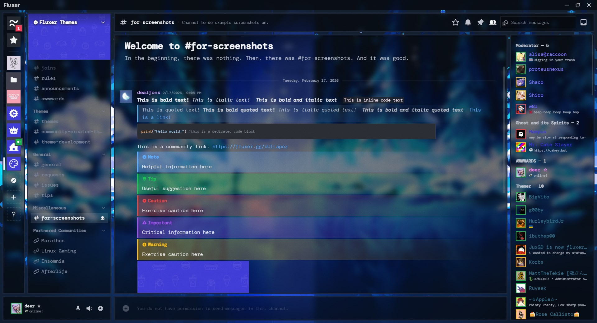
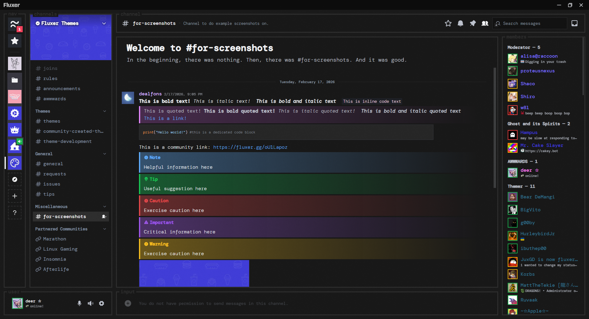
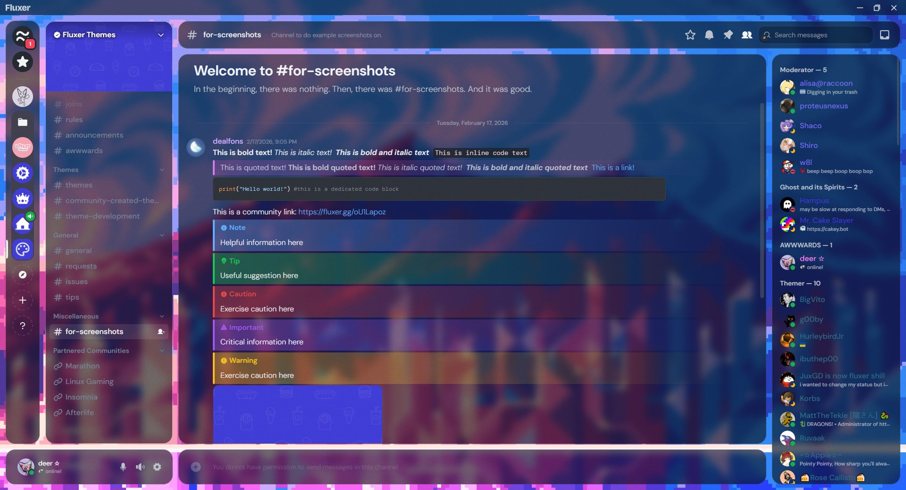
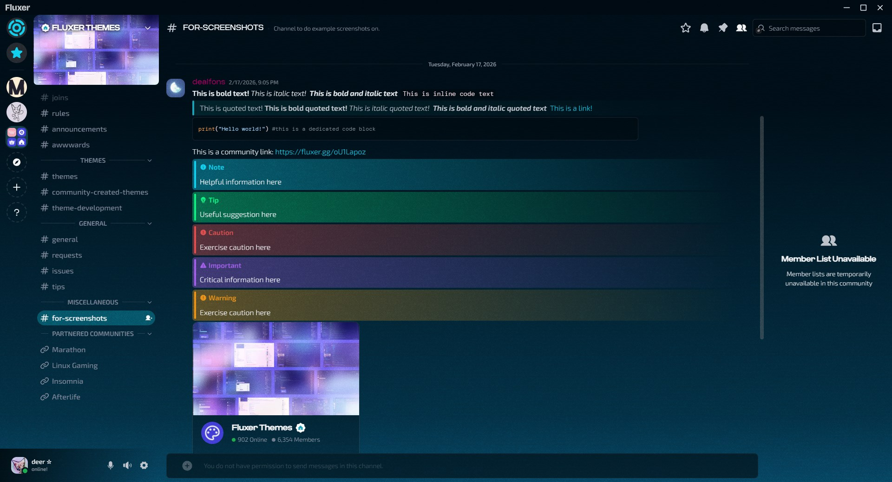
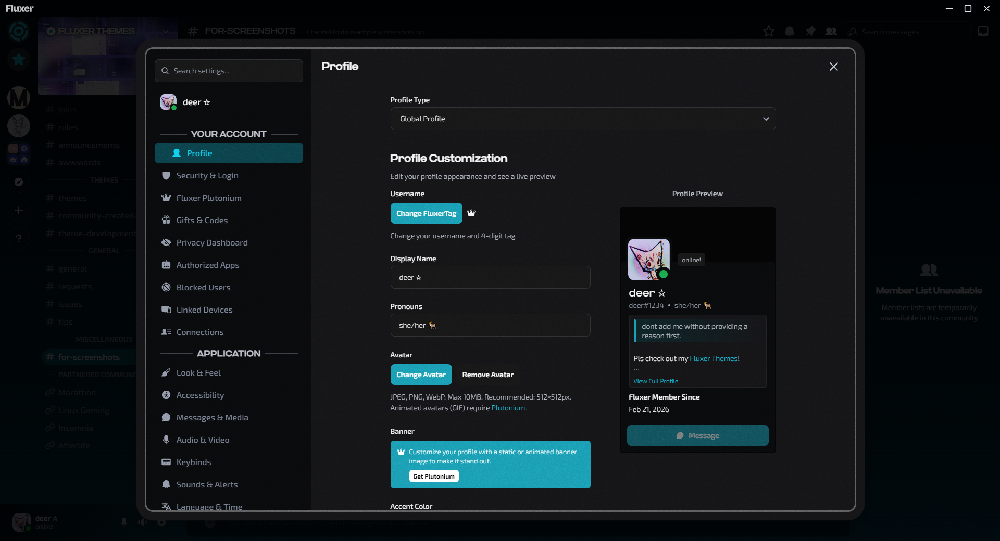

## Installation
simply click one of the theme preset links. fluxer should automatically open and prompt you to apply the theme. 

# System-Glass Theme
a highly customizable frosted glass theme for fluxer, based on refact0r's tui style discord theme [system24](https://github.com/refact0r/system24/). this is NOT a port. 

### Presets
- System-Glass (default): 	https://web.fluxer.app/theme/1a427a8ec15b2fd8
- system24: 				https://web.fluxer.app/theme/cfae62cde032c4f4
- midnight-glass: 			https://web.fluxer.app/theme/e1aa912cfa59fdbf

## Customization
All customization options are located inside the first body {} and :root {} tags. every option is clearly labeled and comes with descriptions. 

Hopefully as fluxer grows the developers will losen some import restrictions to further improve this theme's customizability through presets.

## Credits
- backgrounds: [ThaSilentArtist](https://www.pixilart.com/thasilentartist)
- small CSS snippets: [refact0r](https://github.com/refact0r/)

## System Glass Screenshots

---
---

# PRIME Theme
a customizable theme based on Neon Prime. Includes options for horizontal server list, hiding blocked user messages, outline online status & more

### Presets
- PRIME: 					https://web.fluxer.app/theme/67cb057e0bc273d7

## PRIME Screenshots

