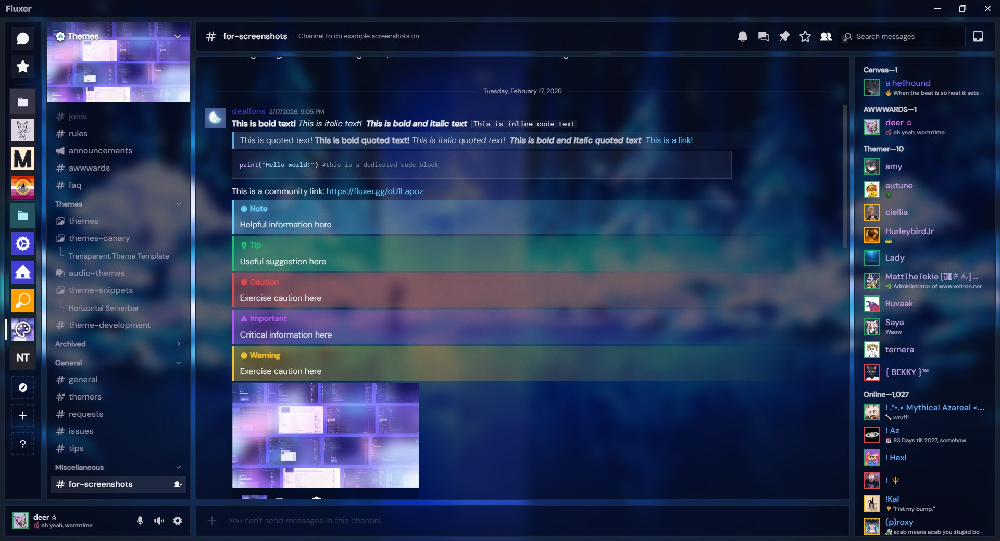
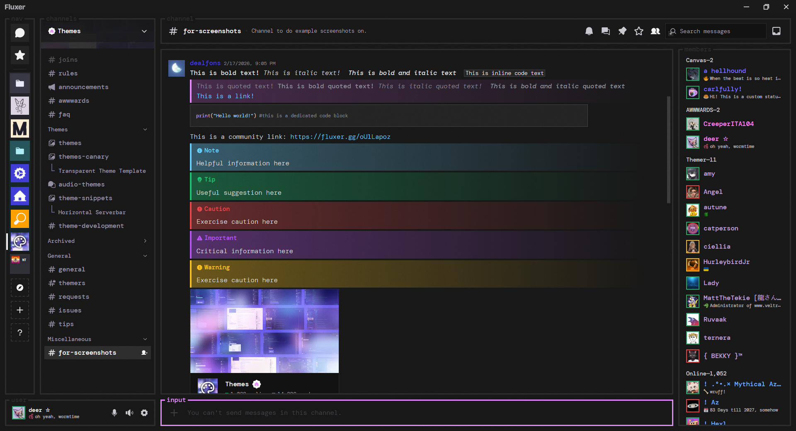
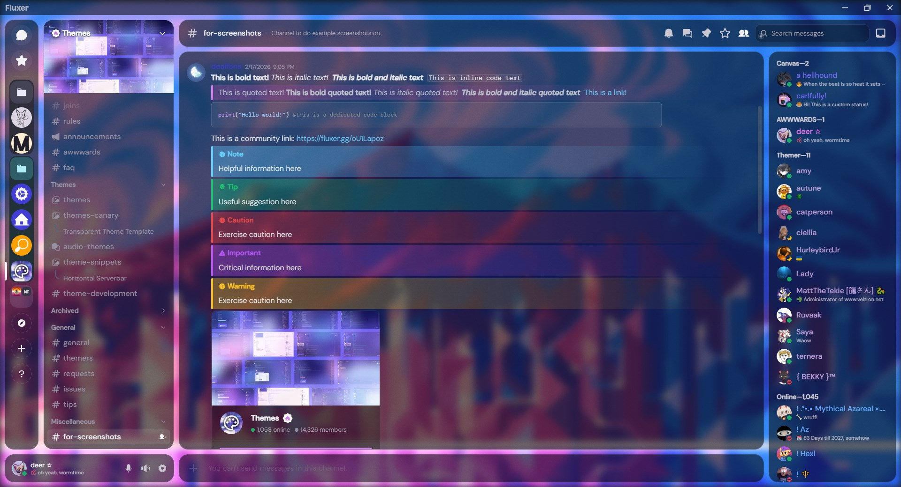
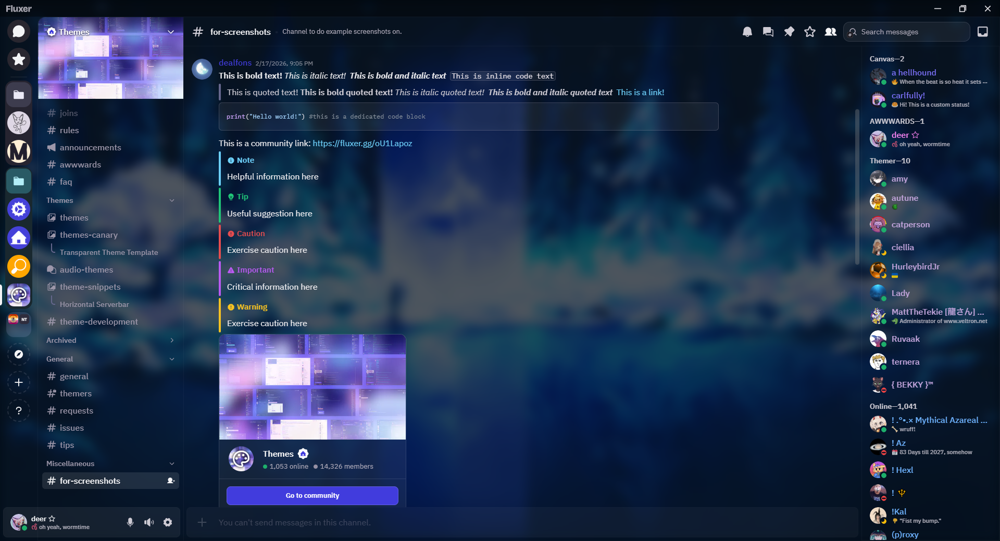

## Installation
simply click one of the theme preset links. fluxer should automatically open and prompt you to apply the theme. 

# System-Glass Theme
a highly customizable frosted glass theme for fluxer, based on refact0r's tui style discord theme [system24](https://github.com/refact0r/system24/).

### Presets
- System-Glass: 			https://web.canary.fluxer.app/theme/1e7976e8ef536ea4
- Terminal: 				https://web.canary.fluxer.app/theme/a68c5afc748e8915
- Crystal: 					https://web.canary.fluxer.app/theme/020f3007ecfa636e

### Customization
All customization options are located inside the first body {} and :root {} tags. every option is clearly labeled and comes with descriptions. 

Hopefully as fluxer grows the developers will losen some import restrictions to further improve this theme's customizability through presets.

### Credits
- backgrounds: [ThaSilentArtist](https://www.pixilart.com/thasilentartist)
- small CSS snippets: [refact0r](https://github.com/refact0r/)

## System Glass Screenshots

---
---

# PRIME Theme
a customizable theme based on Neon Prime. Includes options for horizontal server list, hiding blocked user messages, outline online status & more

### Presets
- PRIME: https://web.canary.fluxer.app/theme/a73803d4532de20f

## PRIME Screenshots

# Transparent Theme Template
Customizable transparent theme template that can also serve as a standalone theme if you just want to add a background image to the client. i've added a lot of comments so hopefully it won't be hard to modify. also supports the built in "coal" and "light" themes. check my github repo for updates

